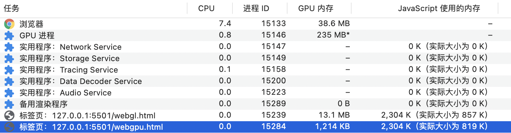

# LUT Filter 

Rendering image with LUT filter effect.

## Install

```sh
# yarn
yarn add lut-filter
# npm
npm install lut-filter
```

## Usage

### WebGL

```js
import lutFilter from 'lut-filter/webgl'

lutFilter({
  canvas: <HTMLCanvasElement>,
  image: <HTMLImageElement>,
  filterImage: <HTMLImageElement>
})
```

[Playground](https://jsbin.com/gixozet)

### WebGPU

```js
import lutFilter from 'lut-filter/webgpu'

lutFilter({
  canvas: <HTMLCanvasElement>,
  image: <HTMLImageElement>,
  filterImage: <HTMLImageElement>
})
```

[Playground](https://jsbin.com/daxexom)

## WebGPU vs WebGL



## LICENSE

[MIT](LICENSE)
